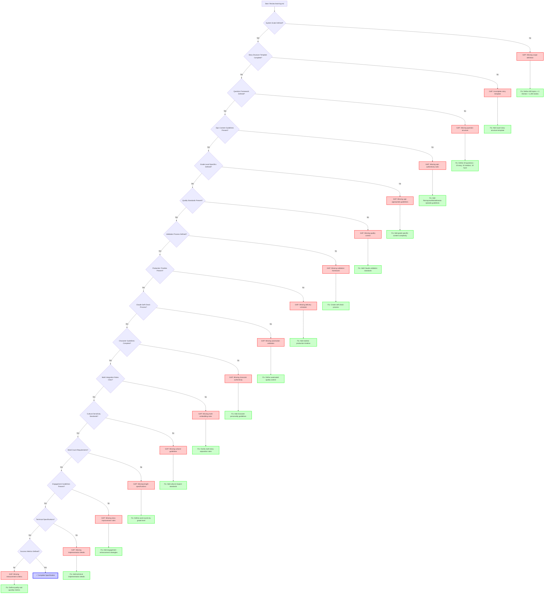

# Learning.md Gap Analysis Flowchart

## Gap Analysis Checklist

### ✅ RESOLVED GAPS (Fixed in recent updates)
- [x] **System Scale**: 400 topics × 3 themes = 1,200 stories ✓
- [x] **Story Structure**: 4-part template with word percentages ✓
- [x] **Question Framework**: 30 questions (10 easy, 10 medium, 10 hard) ✓
- [x] **Epic Guidelines**: Grade-appropriate episodes and characters ✓
- [x] **Quality Standards**: Claude validation checklist ✓
- [x] **Production Timeline**: 5-7 week realistic schedule ✓
- [x] **Character Guidelines**: Personality traits for epic characters ✓
- [x] **Cultural Sensitivity**: Respectful representation standards ✓
- [x] **Word Count Requirements**: Grade-level length specifications ✓
- [x] **Engagement Guidelines**: Story improvement strategies ✓

### ⚠️ POTENTIAL REMAINING GAPS
- [ ] **Sample Stories**: Need complete examples for each theme and grade
- [ ] **Math Topic Prioritization**: Which 400 topics from 600 possibilities?
- [ ] **Error Handling**: What if Claude validation fails?
- [ ] **Version Control**: How to track story revisions and improvements?
- [ ] **Batch Processing**: Optimal order for generating 1,200 stories?

### 🔍 VALIDATION QUESTIONS
1. Are all mathematical concepts from Florida B.E.S.T. standards covered?
2. Do epic stories maintain authentic cultural representation?
3. Can Claude consistently generate 30 contextual questions per story?
4. Are engagement strategies sufficient for 2-6 minute reading sessions?
5. Is the production timeline realistic for quality maintenance?

## Usage Instructions
1. **Run through flowchart** for any major learning.md changes
2. **Check each decision point** against current specification
3. **Flag gaps** and use provided fix suggestions
4. **Validate resolution** by re-running flowchart
5. **Document changes** in specification version history