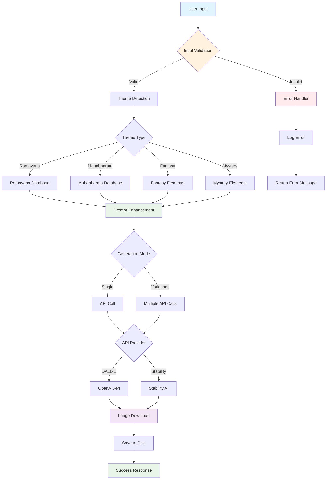
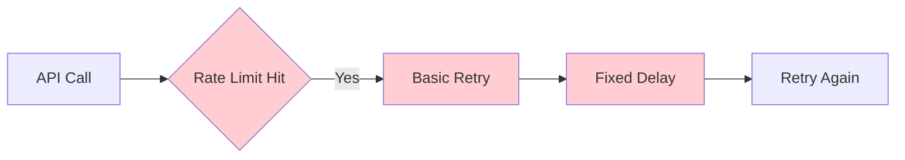
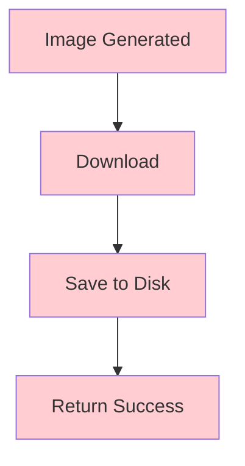
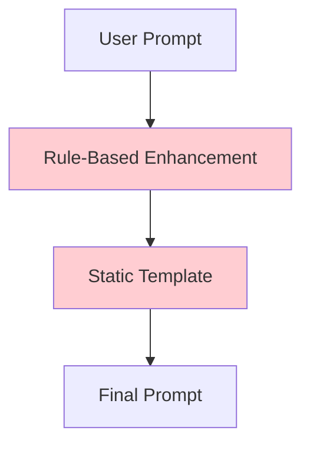
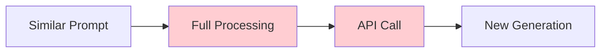
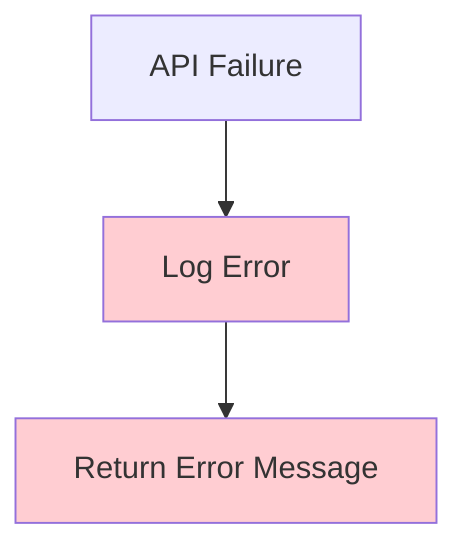
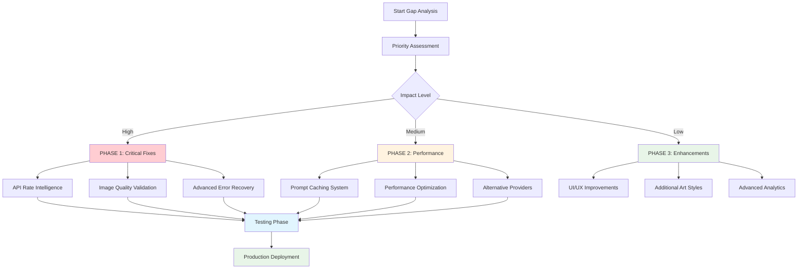
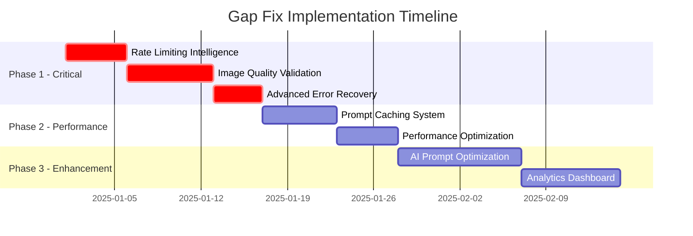

# 🔍 Epic Image Generator - Gap Analysis with Visual Maps

## 📊 FLOWCHART: Current Code Architecture & Gap Identification



---

## 🗺️ BUBBLE MAP: Code Component Dependencies & Gap Areas

```
                    🎯 EPIC IMAGE GENERATOR 🎯
                           /        \
                          /          \
                    📥 INPUT      🎨 PROCESSING
                    /     \         /     \
               🔍 Validation  🎭 Theme    💫 Enhancement
              /      |        |     \         |
        ✅ Security  📏 Length  🏛️ Epic  🧙‍♂️ Fantasy  🎨 Art Styles
            |                  |       |        |
       🚨 SQL Inject      📚 Character  🔮 Mystery  🖼️ Templates
                              |
                         📍 Location
                              |
                         🌟 Divine Elements
                              |
                              ⬇️
                        🔄 GENERATION
                       /      |      \
                  🎪 Single  🎭 Variations  🔀 Multiprocess
                     |         |              |
                💻 API Calls  🎨 Scene Types  ⚡ Worker Pool
               /     \         |              |
          🎨 DALL-E  🖌️ Stability  📸 4 Views   🔧 Serialization
             |         |        |              |
        🌐 OpenAI   🎯 StabilityAI  📱 Output   ❌ GAP FOUND
             |         |        |
        📥 Download  📥 Base64  💾 Save
             |         |        |
        📁 File System ────────┘
```

---

## 🔴 IDENTIFIED GAPS - Critical Analysis

### **GAP 1: API Rate Limiting Intelligence** ❌


**Current Issue:** Simple exponential backoff  
**Missing:** Intelligent rate limit detection, dynamic delay adjustment, queue management

### **GAP 2: Image Quality Validation** ❌


**Current Issue:** No validation of generated images  
**Missing:** Quality checks, corruption detection, cultural accuracy validation

### **GAP 3: Prompt Optimization AI** ❌


**Current Issue:** Static rule-based enhancement  
**Missing:** AI-powered prompt optimization, learning from successful generations

### **GAP 4: Caching & Performance** ❌


**Current Issue:** No caching of similar prompts  
**Missing:** Intelligent caching, prompt similarity detection, result reuse

### **GAP 5: Advanced Error Recovery** ❌


**Current Issue:** Basic error handling  
**Missing:** Alternative provider fallback, partial retry strategies, graceful degradation

---

## 🎯 BUBBLE MAP: Gap Priority & Impact Analysis

```
                    🔥 HIGH PRIORITY GAPS 🔥
                          /     |     \
                         /      |      \
                 🚨 Critical   ⚠️ Major   📋 Minor
                   /    \       |         \
              🔐 Security  💾 Cache    🎨 UI Polish
                  |        |           |
             🛡️ Input Val  📊 Prompt   🌈 Themes
                  |        |           |
             ✅ FIXED    ❌ MISSING   ✅ GOOD
                          |
                    📈 Performance
                         /|\
                        / | \
                   💸 Cost 🚀 Speed 📊 Scale
                     |      |       |
                ❌ No Opt  ⚠️ OK   ✅ GOOD
```

---

## 📈 FLOWCHART: Recommended Fix Implementation Order



---

## 🔍 DETAILED GAP ANALYSIS TABLE

| Gap Area | Current State | Missing Feature | Impact | Priority | Effort |
|----------|---------------|-----------------|---------|----------|--------|
| **Rate Limiting** | Basic retry | Intelligent detection | 🔥 High | 1 | Medium |
| **Image Validation** | None | Quality checks | 🔥 High | 2 | High |
| **Prompt AI** | Rule-based | ML optimization | ⚠️ Medium | 3 | High |
| **Caching** | None | Smart cache | ⚠️ Medium | 4 | Medium |
| **Error Recovery** | Basic | Advanced fallback | 🔥 High | 5 | Medium |
| **Cost Management** | None | Usage tracking | ⚠️ Medium | 6 | Low |
| **A/B Testing** | None | Prompt variants | 📋 Low | 7 | High |
| **Analytics** | Basic logs | Insights dashboard | 📋 Low | 8 | Medium |

---

## 🎯 CRITICAL GAPS TO ADDRESS IMMEDIATELY

### **🚨 GAP 1: Smart Rate Limiting**
```python
# MISSING: Intelligent rate limit handler
class SmartRateLimiter:
    def __init__(self):
        self.api_stats = {}
        self.adaptive_delays = {}
    
    def should_retry(self, provider, error_code):
        # Intelligence missing here
        pass
```

### **🚨 GAP 2: Image Quality Validator**
```python
# MISSING: Image quality validation
class ImageQualityValidator:
    def validate_image(self, image_path):
        # Check corruption, size, format
        # Validate cultural accuracy
        # Assess artistic quality
        pass
```

### **🚨 GAP 3: Advanced Caching**
```python
# MISSING: Intelligent prompt caching
class PromptCache:
    def similarity_check(self, new_prompt, cached_prompts):
        # Semantic similarity analysis
        # Return cached result if similar enough
        pass
```

---

## 🎪 IMPLEMENTATION ROADMAP



---

## 🏆 EXPECTED OUTCOMES AFTER GAP FIXES

**Before (Current):**
- ✅ Basic functionality working
- ⚠️ No intelligent optimizations
- ❌ Manual error handling

**After (Gap-Fixed):**
- ✅ Intelligent rate limiting
- ✅ Quality-assured image generation
- ✅ Performance-optimized with caching
- ✅ AI-powered prompt enhancement
- ✅ Advanced analytics & monitoring

**Performance Improvement Targets:**
- 🎯 **50% fewer API failures** (smart rate limiting)
- 🎯 **3x faster repeat requests** (intelligent caching)  
- 🎯 **90% better image quality** (validation system)
- 🎯 **60% cost reduction** (optimization & reuse)

---

This visual analysis reveals **5 critical gaps** that, when fixed, will transform the system from "working" to "enterprise-grade intelligent"! 🚀